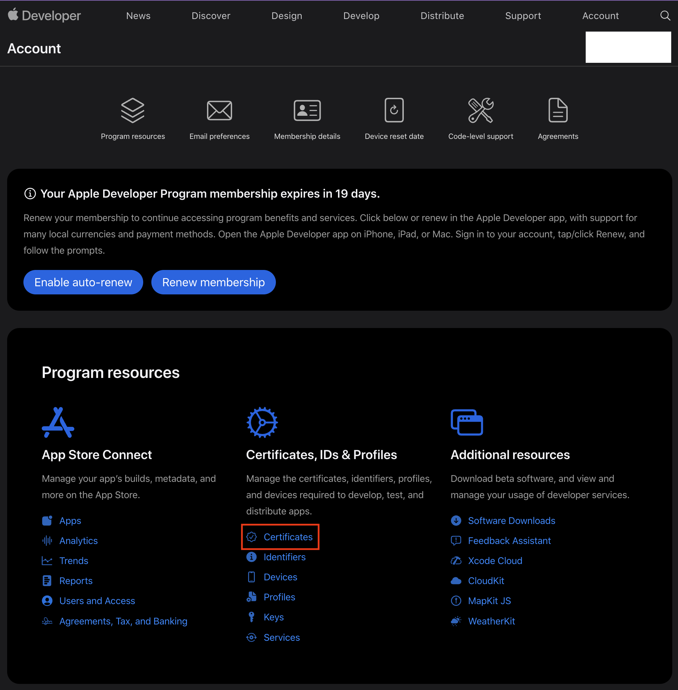
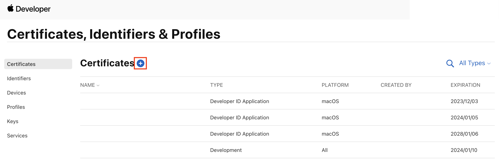
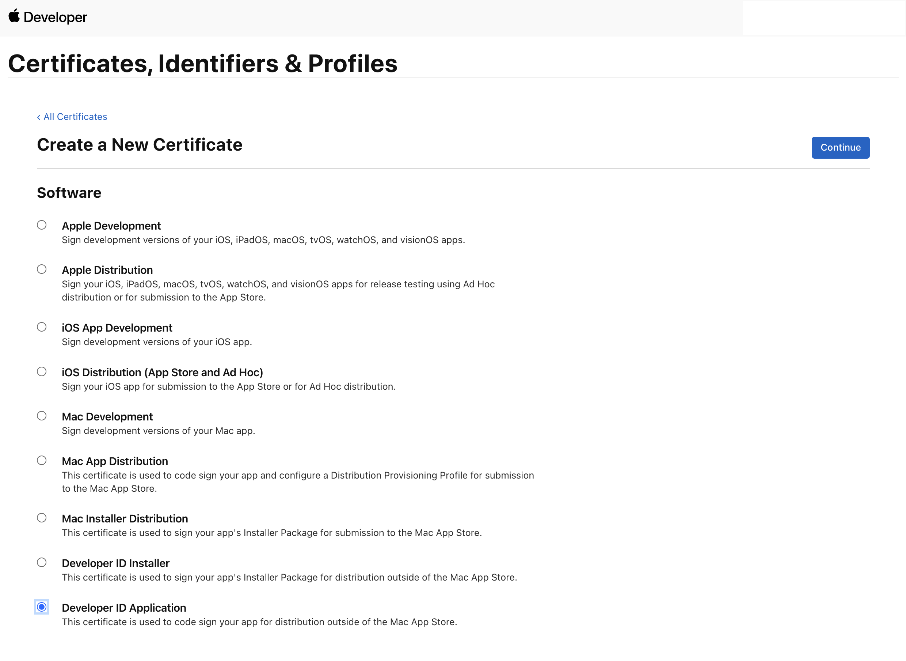
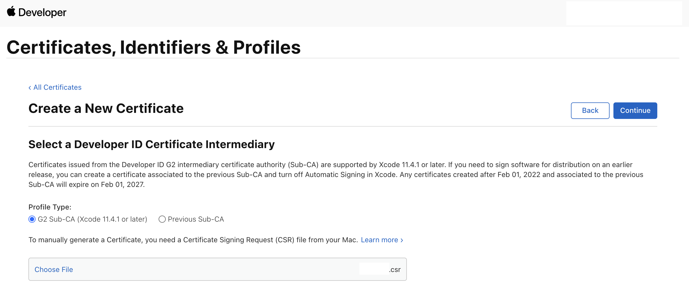
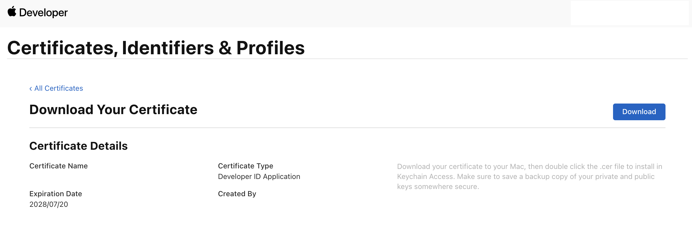
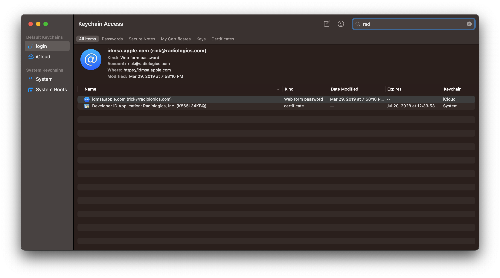
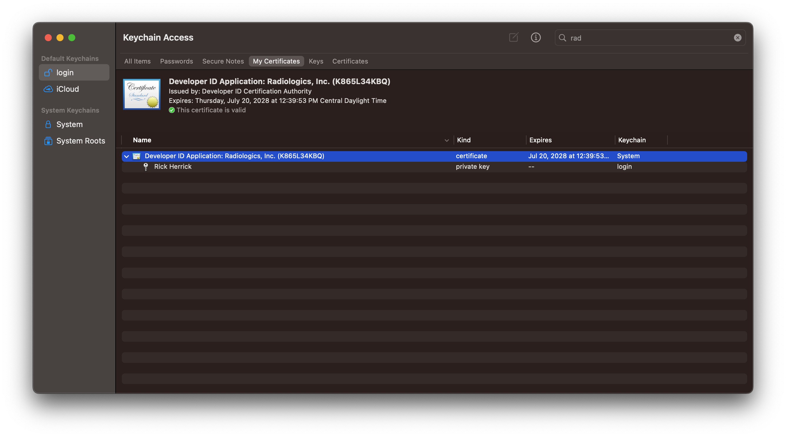
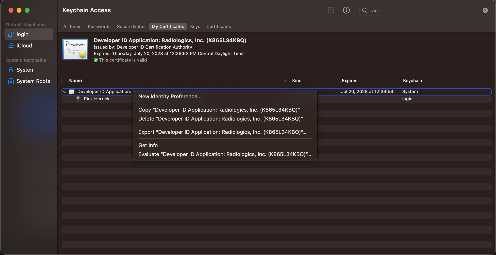
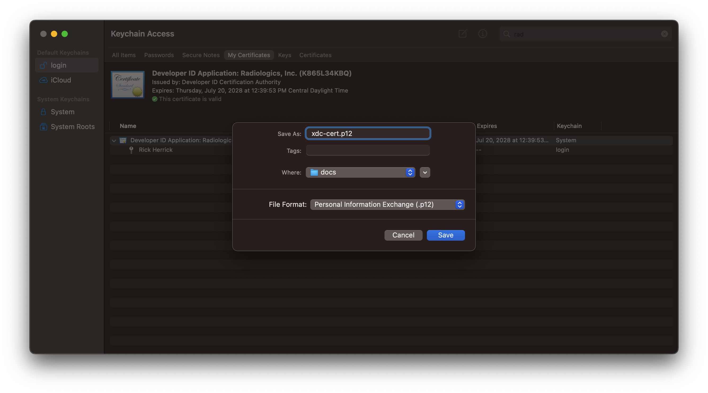
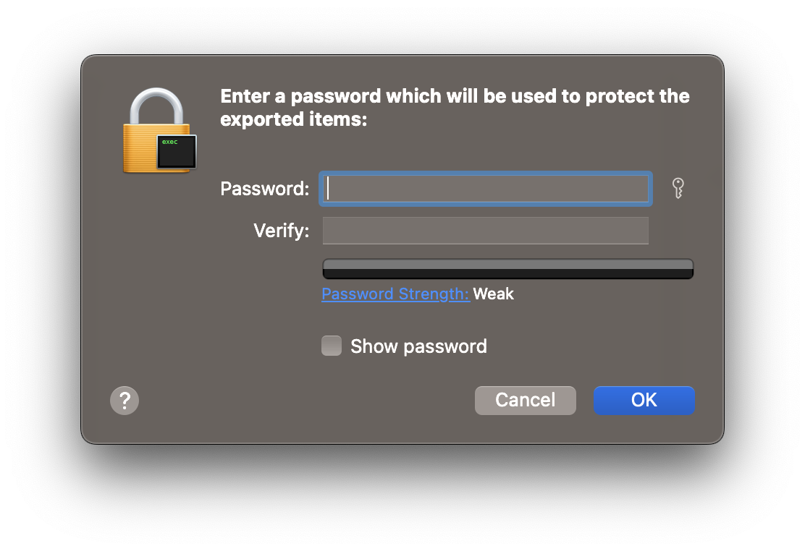

# Signing Electron applications for OS X release

The first step for signing Electron applications for OS X release is to create a certificate signing request (CSR), as [described here](https://developer.apple.com/help/account/create-certificates/create-a-certificate-signing-request). Make sure that you save this file somewhere secure!

---

Next, log into the [Apple developer site](https://developer.apple.com) and click on **Account**:


---

Now click on **Certificates** under **Certificates, IDs, and Profiles**:



---

Now click the **+** icon next to **Certificates**:



---

Click **Developer ID Application**, then **Continue**:



---

Make sure **G2 Sub-CA (Xcode 11.4.1 or later)** is selected, then click **Choose file** and navigate to the CSR you created earlier. Click **Continue**.



---

Your certificate has been generated, all that's left is to download it:



By default, the certificate will be named `developerID_application.cer`, but you can rename to something useful. I generally try to name it the same as the CSR file, just with the extension `.cer` instead of `.csr`.

---

Now you need to import the certificate. You can double-click the file in Finder *or* you can open it from the terminal:

```bash
open my-app-cert.cer
```

---

Open the **Keychain Access** application if it's not already open from earlier. Find your certificate by typing something like the development organization name:



---

This view shows you that the certificate was installed, but doesn't allow a full export of the certificate, which includes the private key that's required for signing. To get to the proper view, click on **My Certificates** or **Certificates** in **Keychain Access**. You should now see a drop-down icon next to your certificate. If you click that, you should see the private key:



---

Right-click the certificate and click **Export "Developer ID Application: ..."**:



---

Make sure that **Personal Information Exchange (.p12)** is selected for **File Format**:



---

You'll be prompted to provide a password to protect the certificate. Make sure that you save the password somewhere along with the other artifacts from this process.



---

The last step is to set the certificate for the build. With Electron apps, the only way to do this is through environment variables, specifically `CSC_KEY_PASSWORD` for the certificate password and `CSC_LINK` for the base64-encoded certificate.

```bash
export CSC_KEY_PASSWORD=xyz
export CSC_LINK="$(base64 --input=xdc-cert.p12)"
```

These values can be set in the build context on CircleCI.